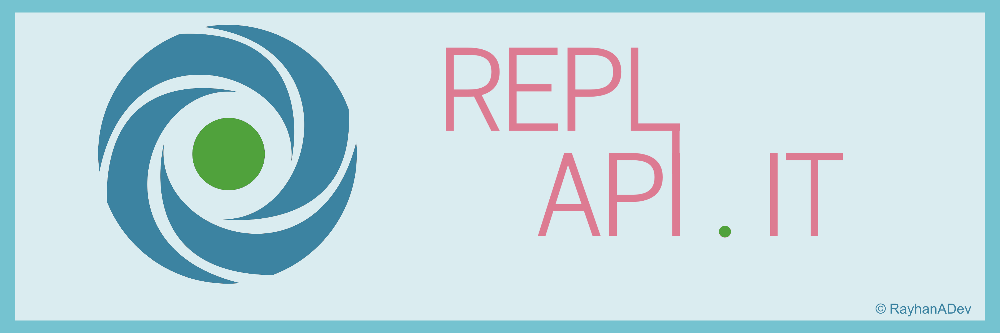
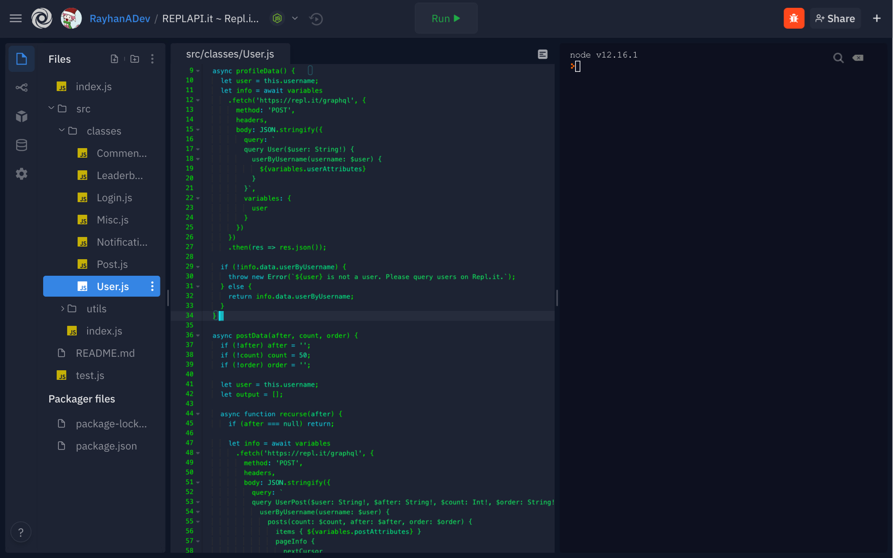

> ⚠️ **IMPORTANT**: ReplAPI.it is now in version 2.x! Any projects transitioning to 2.x should read through [this](https://github.com/ReplAPI-it/ReplAPI.it/releases/tag/v2.0.6). ⚠️

[![Contributors][contributors-shield]][contributors-url]
[![Forks][forks-shield]][forks-url]
[![Stargazers][stars-shield]][stars-url]
[![Issues][issues-shield]][issues-url]
[![MIT License][license-shield]][license-url]
[![Downloads][downloads-shield]][downloads-url]

<!-- PROJECT LOGO -->
<br />
<p align="center">
  <a href="https://github.com/ReplAPI-it/REPLAPI.it">
    
  </a>

  <h3 align="center">REPLAPI.it</h3>

  <p align="center">
    A Simple and Complete Replit API Package
    <br />
    <a href="https://replapi-it.js.org"><strong>Explore the docs »</strong></a>
    <br />
    <br />
    <a href="https://www.npmjs.com/package/replapi-it">View Package on NPM</a>
    ·
    <a href="https://github.com/ReplAPI-it/REPLAPI.it/issues">Report Bug</a>
    ·
    <a href="https://github.com/ReplAPI-it/REPLAPI.it/issues">Request Feature</a>
  </p>
</p>


<!-- TABLE OF CONTENTS -->
<details open="open">
  <summary><h2 style="display: inline-block">Table of Contents</h2></summary>
  <ol>
    <li>
      <a href="#about-the-project">About The Project</a>
      <ul>
        <li><a href="#built-with">Built With</a></li>
      </ul>
    </li>
    <li>
      <a href="#getting-started">Getting Started</a>
      <ul>
        <li><a href="#prerequisites">Prerequisites</a></li>
        <li><a href="#installation">Installation</a></li>
      </ul>
    </li>
    <li><a href="#usage">Usage</a></li>
    <li><a href="#roadmap">Roadmap</a></li>
    <li><a href="#contributing">Contributing</a></li>
    <li><a href="#license">License</a></li>
    <li><a href="#contact">Contact</a></li>
    <li><a href="#acknowledgements">Acknowledgements</a></li>
  </ol>
</details>


<!-- ABOUT THE PROJECT -->
## About The Project

[](https://replit.com/@ReplAPIit/Package)

The Replit GraphQL API is an extraordinary way to make projects unique and special, yet with the numerous packages available few such projects have been made. Why would that be? Most likely due to how complicated writing code can get and the limitations of their queries. My package, **ReplAPI.it**, changes that with a simple to use structure and many queries, some of which are:

* Queries for Data on Users (such as Profile, Posts, Comments)
* Queries for Data on Posts (such as Upvoters, Content)
* Queries for Data on Repls (such as Files, Comments)
* Mutations for Commenting, Reporting, and Posting
* Queries for Data on Leaderboard (with filters such as cycles since)
* and lots more!

My package is also simple to use with it's **class-based structure**. Simply create a new class for your User, Post, or whatever your heart desires and use built in functions with options to query data **your way**.

### Built With

* [NodeJS](https://github.com/nodejs/node)

## Getting Started

I suggest requiring the ReplAPI.it module until ES imports in NodeJS are stabilized.

### Prerequisites

If you have not already download npm:
* npm
  ```sh
  npm install npm@latest -g
  ```

### Installation

1. Install the latest version of the package
   ```sh
   $ npm install replapi-it
   ```
2. Require the package in your code
   ```js
   import ReplAPI from 'replapi-it';
   ``` 
3. Initilize the package
   ```js
   const replapi = ReplAPI({
      username: 'your-username-here'
   });
   ```

## Usage

Using ReplAPI.it is very simple! Let's create a simple user and ask for their cycles:
 ```js
 import ReplAPI from 'replapi-it
 const replapi = ReplAPI({
   username: 'your-username-here'
 });
 
 const myUser = new replapi.User("RayhanADev");

 async function getCycles() {
   let info = await myUser.userGraphQLDataFull();
   let cycles = info.karma; // Yep, it's karma!
   console.log(`User Cycles: ${cycles}`)
 }
 
 getCycles()
 ```

Output:
 ```
 User Cycles: 1008
 ```


That was fun! Now how about getting a specific post? Let's create a simple post and ask for it's title:
 ```js
 import ReplAPI from 'replapi-it
 const replapi = ReplAPI({
   username: 'your-username-here'
 });

 const myPost = new replapi.Post(78043);

 async function getTitle() {
   let info = await myPost.postDataFull();
   let title = info.title;
   console.log(`Post Title: ${title}`)
 }
 
 getTitle()
 ```
Output:
 ```
 Post Title: Presenting... 🤔 RayhanADev 🤔? (GraphQL Success!)
 ```

_For more examples, please refer to the [Documentation](https://replapi-it.js.org)_

## Roadmap

See the [open issues](https://github.com/RayhanADev/REPLAPI.it/issues) for a list of proposed features (and known issues).

I'm considering adding in support for Crosis communications after they distribute developer keys again. Right now I'm experimenting with WSS and eval.repl.it for code execution!

## Contributing

Contributions are **much appreciated**, and if you have a cool idea that feels right in this package then you should check out our [contributing](.github/CONTRIBUTING.md) page.

## License

Distributed under the GPL-3.0 License. See `LICENSE` for more information.

## Contact

RayhanADev - [@RayhanADev](https://replit.com/@RayhanADev) - rayhanadev@protonmail.com

Project Link: [https://github.com/ReplAPI-it/REPLAPI.it](https://github.com/ReplAPI-it/REPLAPI.it)

## Acknowledgements

* [cursorweb](https://github.com/cursorweb) aka [mrlapizgithub](https://github.com/mrlapizgithub) for several dozen GraphQL queries
* [kognise](https://github.com/kognise) for open-sourcing eval.repl.it's usage
* [mat-1](https://github.com/mat-1) for their original Replit API package


<!-- MARKDOWN LINKS & IMAGES -->
<!-- https://www.markdownguide.org/basic-syntax/#reference-style-links -->
[contributors-shield]: https://img.shields.io/github/contributors/ReplAPI-it/REPLAPI.it.svg?style=for-the-badge
[contributors-url]: https://github.com/ReplAPI-it/REPLAPI.it/graphs/contributors
[forks-shield]: https://img.shields.io/github/forks/ReplAPI-it/REPLAPI.it.svg?style=for-the-badge
[forks-url]: https://github.com/ReplAPI-it/REPLAPI.it/network/members
[stars-shield]: https://img.shields.io/github/stars/ReplAPI-it/REPLAPI.it.svg?style=for-the-badge
[stars-url]: https://github.com/ReplAPI-it/REPLAPI.it/stargazers
[issues-shield]: https://img.shields.io/github/issues/ReplAPI-it/REPLAPI.it.svg?style=for-the-badge
[issues-url]: https://github.com/ReplAPI-it/REPLAPI.it/issues
[license-shield]: https://img.shields.io/github/license/ReplAPI-it/REPLAPI.it.svg?style=for-the-badge
[license-url]: https://github.com/ReplAPI-it/REPLAPI.it/blob/master/LICENSE.txt
[downloads-shield]: https://img.shields.io/npm/dw/replapi-it?style=for-the-badge
[downloads-url]: https://www.npmjs.com/package/replapi-it
